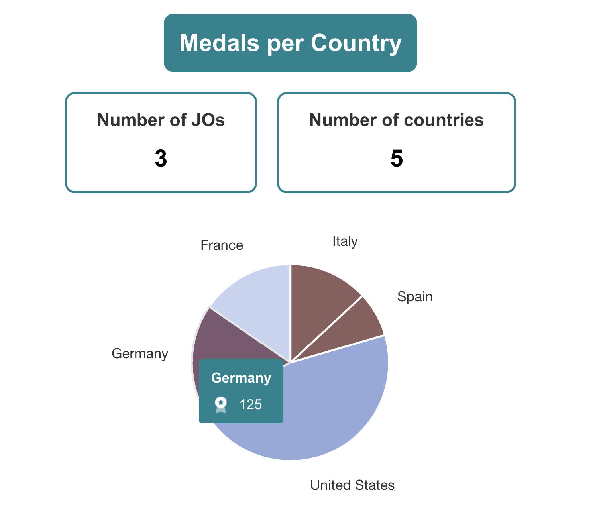

# OlympicGamesStarter

Ce projet a été généré avec [Angular CLI](https://github.com/angular/angular-cli) version 18.0.3.

N'oubliez pas d'installer vos `node_modules` avant de commencer (`npm install`).

## Serveur de développement

Exécutez `ng serve` pour démarrer un serveur de développement. Accédez à `http://localhost:4200/`. L'application se rechargera automatiquement si vous modifiez l'un des fichiers source.

## Construction

Exécutez `ng build` pour construire le projet. Les artefacts de construction seront stockés dans le répertoire `dist/`.

## Par où commencer

Comme vous pouvez le voir, une architecture a déjà été définie pour le projet. Ce n'est qu'une suggestion, vous pouvez choisir d'utiliser la vôtre. L'architecture prédéfinie comprend (en plus de l'architecture Angular par défaut) les éléments suivants :

- Dossier `components` : contient tous les composants réutilisables
- Dossier `pages` : contient les composants utilisés pour le routage
- Dossier `core` : contient la logique métier (dossiers `services` et `models`)

Je vous suggère de commencer par comprendre ce code de démarrage. Portez une attention particulière à `app-routing.module.ts` et `olympic.service.ts`.

Une fois maîtrisé, vous devriez continuer en créant les interfaces TypeScript dans le dossier `models`. Comme vous pouvez le voir, j'ai déjà créé deux fichiers correspondant aux données incluses dans `olympic.json`. Avec vos interfaces, améliorez le code en remplaçant chaque `any` par l'interface correspondante.

Vous êtes maintenant prêt à implémenter les fonctionnalités demandées.

## Fonctionnement des Composants

### HomeComponent

Le `HomeComponent` est responsable de l'affichage de la page d'accueil et de la visualisation des données olympiques sous forme de graphique en secteurs.

- **Fichier** : `src/app/pages/home/home.component.ts`
- **Description** : Ce composant récupère les données olympiques via le `OlympicService` et crée un graphique en secteurs pour afficher le nombre total de médailles par pays.
- **Méthodes principales** :
  - `ngOnInit` : Initialise le composant et charge les données olympiques.
  - `createChart` : Crée un graphique en secteurs avec les données récupérées.
  - `getTotalMedals` : Calcule le nombre total de médailles pour un pays donné.

### DetailComponent

Le `DetailComponent` est responsable de l'affichage des détails d'un pays spécifique, y compris un graphique en ligne montrant le nombre de médailles au fil des ans.

- **Fichier** : `src/app/pages/detail/detail.component.ts`
- **Description** : Ce composant récupère les détails d'un pays spécifique via le `OlympicService` et crée un graphique en ligne pour afficher le nombre de médailles au fil des ans.
- **Méthodes principales** :
  - `ngOnInit` : Initialise le composant et charge les détails du pays sélectionné.
  - `createLineChart` : Crée un graphique en ligne avec les données récupérées.
  - `getTotalMedals` : Calcule le nombre total de médailles pour le pays.
  - `getTotalAthletes` : Calcule le nombre total d'athlètes pour le pays.
  - `onBack` : Navigue vers la page d'accueil.

### OlympicService

Le `OlympicService` est responsable de la gestion des données olympiques, y compris la récupération et le chargement initial des données.

- **Fichier** : `src/app/core/services/olympic.service.ts`
- **Description** : Ce service fournit des méthodes pour récupérer les données olympiques depuis une source de données.
- **Méthodes principales** :
  - `getOlympics` : Récupère les données olympiques sous forme d'Observable.
  - `loadInitialData` : Charge les données initiales depuis une source de données.

### Modèles

Les modèles définissent la structure des données utilisées dans l'application.

- **Olympic** : Représente un pays et ses participations aux Jeux Olympiques.
  - **Fichier** : `src/app/core/models/Olympic.ts`
  - **Propriétés** :
    - `id` : Identifiant unique du pays.
    - `country` : Nom du pays.
    - `participations` : Liste des participations du pays aux Jeux Olympiques.

- **Participation** : Représente une participation d'un pays à une édition des Jeux Olympiques.
  - **Fichier** : `src/app/core/models/Participation.ts`
  - **Propriétés** :
    - `year` : Année de l'édition des Jeux Olympiques.
    - `city` : Ville hôte des Jeux Olympiques.
    - `medalsCount` : Nombre de médailles remportées.
    - `athleteCount` : Nombre d'athlètes participants.
